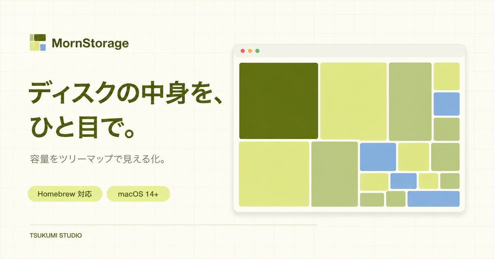

# MornStorage

ディスク使用量をツリーマップで可視化する Mac アプリです (SpaceSniffer 風)。
macOS 14 以降対応。

## Homebrew での導入

```bash
brew install --cask tsukumistudio/tap/mornstorage
```

## Homebrew での更新

```bash
brew update
brew upgrade --cask mornstorage
```

アプリ内の「更新を確認」からも更新できます。

## Homebrew でのアンインストール

```bash
brew uninstall --cask mornstorage
```

## 使い方

1. 「ボリュームを選択」でスキャンするディスクを選びます。スキャン中も見つかった順に描画されます。
   次回起動時は同じディスクを自動で開き、前回の結果を即座に表示しながら裏で再スキャンし、完了時に差し替えます (`~/Library/Application Support/MornStorage/`)。
2. 面積がサイズに比例したタイルで表示されます。枠線だけのものがフォルダ、色付きタイルがファイルで、色は拡張子ごとに決まります。
3. 右上の ⊟ ⊞ で見えているフォルダ全体の階層の深さを増減できます。特定のフォルダだけ変えるには右クリックの詳細表示・簡易表示を使います。
4. 矩形にカーソルを合わせると下部にパスとサイズが出ます。フォルダをクリックすると選択され、中身が開閉します。
5. 右クリックメニュー: 詳細表示 (そのフォルダを 1 階層深く) / 簡易表示 (1 階層浅く) / 注目表示 (そのフォルダを親にして表示、パンくずで戻る) / Finderで表示 / 削除 (確認後にゴミ箱へ移動。スキャン中は無効)。
6. ウィンドウを閉じるとアプリごと終了します。

環境変数 `MORNSTORAGE_PATH` にパスを入れて起動すると、そのパスを即座にスキャンします。

```bash
open -a MornStorage --env MORNSTORAGE_PATH="$HOME"
```

## アクセス権について

- 初回スキャンで「写真」「デスクトップ」などへのアクセス許可ダイアログが出ます。ダイアログが出ている間はその領域の走査が止まるので、応答するまで進捗が伸びません。
- 全ディスクを一度で読ませるには、システム設定 →「プライバシーとセキュリティ」→「フルディスクアクセス」に MornStorage を追加してください。以後ダイアログは出ません。
- 許可は署名の同一性で記憶されます。`build.sh` は手元に Developer ID 証明書があればそれで署名するので、ビルドし直しても許可は保持されます。証明書が無い環境ではアドホック署名になり、ビルドのたびに再度求められます。

## 開発

```bash
swift test
MORNSTORAGE_BENCH="$HOME/Library" swift test --filter ScannerBench   # 走査速度の計測
zsh build.sh   # dist/MornStorage.app
```

## リリース

`v*` タグを push すると GitHub Actions (`.github/workflows/release.yml`) が次を自動で行います。

1. universal バイナリでビルドし、`Support/Info.plist` のバージョンをタグに合わせる
2. [MornNotary](https://github.com/matsufriends/MornNotary) に zip を送って Developer ID 署名と公証を受ける
3. GitHub Release に `MornStorage.app.zip` を添付
4. [TsukumiStudio/homebrew-tap](https://github.com/TsukumiStudio/homebrew-tap) の `Casks/mornstorage.rb` を更新

```bash
git tag v0.1.0
git push origin main v0.1.0
```

Actions secrets に `MORN_NOTARY_TOKEN` (MornNotary へ push できる PAT) と `HOMEBREW_TAP_TOKEN` (homebrew-tap へ push できる PAT) が必要です。`workflow_dispatch` で手動実行すると、Release と cask を変更せずに署名・公証までを試せます。

## ライセンス

[The Unlicense](LICENSE)
